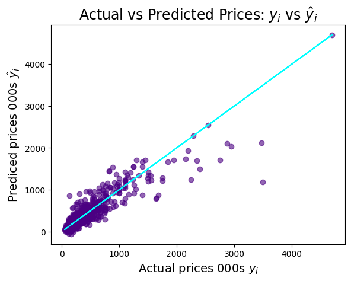
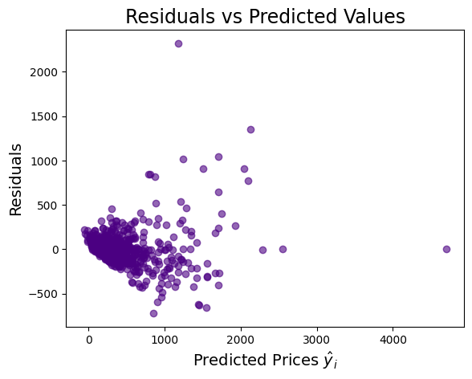
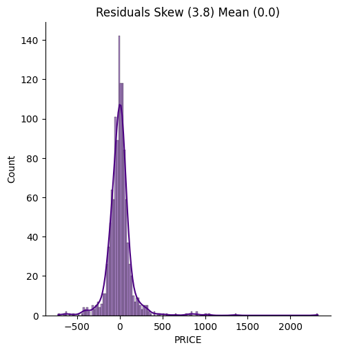

# Price Prediction Model Of Real Estate in Türkiye

## Overview
This project aims to build a model that provides price estimates for houses in Türkiye based on various characteristics of the properties. The model considers data scraped from a real estate website to create a dataset of 3479 properties, each described by 21 features.

## Table of Contents
1. [Introduction](#introduction)
2. [Data](#data)
3. [Methodology](#methodology)
4. [Results](#results)
5. [Conclusion](#conclusion)
6. [Usage](#usage)
7. [License](#license)

## Introduction
The objective of this project is to predict the price of a house in Türkiye based on its characteristics such as the number of rooms, whether it has air conditioning, if it is furnished, etc. Accurate price predictions can aid potential buyers and sellers in making informed decisions.

## Data
The dataset was created by web scraping data from [Tekce Overseas Property](https://tekce.com/property-turkiye). A total of 3479 properties were scraped, each described by 21 features:

| Feature                  | Description                                                                          |
|--------------------------|--------------------------------------------------------------------------------------|
| CITY                     | City where the property is located                                                   |
| DISTRICT                 | District where the property is located                                               |
| NEIGHBOURHOOD            | Neighbourhood where the property is located                                          |
| AIR CONDITIONING         | Dummy variable (= 1 if the property has air conditioning; 0 otherwise)               |
| FURNISHED                | Dummy variable (= 1 if the property is furnished; 0 otherwise)                       |
| CAR PARK                 | Dummy variable (= 1 if the property has a car park; 0 otherwise)                     |
| CENTRAL HEATING          | Dummy variable (= 1 if the property has central heating; 0 otherwise)                |
| GAS COMBI                | Dummy variable (= 1 if the property has a gas combi; 0 otherwise)                    |
| UNDERFLOOR HEATING       | Dummy variable (= 1 if the property has underfloor heating; 0 otherwise)             |
| UNDERFLOOR COOLING       | Dummy variable (= 1 if the property has underfloor cooling; 0 otherwise)             |
| REALTOR FEE              | Fee charged by the realtor                                                           |
| TOTAL FLOORS             | Total number of floors in the building where the property is located                 |
| COMPLETION DATE          | Completion date of the property                                                      |
| SUBTYPE                  | Type of property (e.g., ground floor apartment, detached villa, etc.)                |
| PROPERTY SIZE            | Size of the property in square metres (m²)                                           |
| STOREYS                  | Number of storeys in the property                                                    |
| BEDROOM                  | Number of bedrooms in the property                                                   |
| BATHROOM                 | Number of bathrooms in the property                                                  |
| BALCONY                  | Number of balconies in the property                                                  |
| FLOOR                    | Floor number of the property within the building (if applicable)                     |
| PRICE                    | Price of the property in thousands of euros (€1000's)                                |

### Data Preprocessing
The raw data was preprocessed to handle missing values, encode categorical variables, and normalise numerical features.

## Methodology
1. **Web Scraping**: Used web scraping techniques and a web driver to collect data from the real estate website. The code for this web scraping is located in the `src` folder.
2. **Exploratory Data Analysis (EDA)**: Analysed the distribution and relationships of the features and target variable (house price).
3. **Data Splitting**: Split the dataset into training and testing sets to evaluate the model's performance.
4. **Multivariable Regression**: Built a multivariable regression model to predict house prices.
5. **Model Evaluation**: Evaluated the model's coefficients and residuals to understand its performance.
6. **Price Estimation**: Used the final model to estimate property prices based on given characteristics.

## Results

### Model Training
The final multivariable regression model showed the following performance on the training data:
- **Training Data R-squared**: 0.82

### Model Evaluation
The model's performance on the test data is as follows:
- **Test Data R-squared**: 0.75

#### Performance Metrics
- **Mean Absolute Error (MAE)**: 124.58
- **Mean Squared Error (MSE)**: 61530.24
- **Root Mean Squared Error (RMSE)**: 248.05

### Coefficients

| Feature                   | Coefficient |
|---------------------------|-------------|
| num__AIR CONDITIONING     |       33.25 |
| num__FURNISHED            |      -14.31 |
| num__CAR PARK             |       -0.97 |
| num__CENTRAL HEATING      |       46.73 |
| num__GAS COMBI            |       13.12 |
| num__UNDERFLOOR HEATING   |       98.50 |
| num__UNDERFLOOR COOLING   |      -45.02 |
| num__TOTAL FLOORS         |       10.19 |
| num__PROPERTY SIZE        |        1.69 |
| num__STOREYS              |      -33.62 |
| num__BEDROOM              |       32.78 |
| num__BATHROOM             |       65.09 |
| num__BALCONY              |      -53.20 |
| num__FLOOR                |       -4.19 |
| cat__DISTRICT_Aksu        |     -103.83 |
| cat__DISTRICT_Alanya      |     -166.99 |
| cat__DISTRICT_Döşemealtı  |     -296.24 |
| cat__DISTRICT_Gazipaşa    |     -586.94 |
| cat__DISTRICT_Kaş         |    1,544.89 |
| cat__DISTRICT_Kemer       |       33.81 |

### Visualisations

- **Actual vs Predicted Prices**: This scatter plot shows the relationship between the actual and predicted house prices. A strong correlation indicates the model's effectiveness.
  <p align="center">
    
  </p>

- **Residuals vs Predicted Values**: This plot shows the residuals (differences between actual and predicted prices) against the predicted values. A random pattern suggests that the model's predictions are unbiased.
  <p align="center">
    
  </p>

- **Distribution of Residuals**: This histogram shows the distribution of the residuals, with a mean of 0.0 and skewness of 3.8, indicating that most residuals are close to zero, but there are some larger errors.
  <p align="center">
    
  </p>

### Example Prediction

To demonstrate the model's practical application, here is an example prediction for a property with specific characteristics:

#### Property Characteristics:
- **City**: Antalya
- **District**: Muratpaşa
- **Neighbourhood**: Gebizli
- **Furnished**: Yes
- **Bedroom**: 2

#### Predicted Price:
Based on these characteristics, the model predicts the property price to be approximately €201,652.

## Conclusion
The model successfully predicts house prices in Türkiye with reasonable accuracy. The analysis showed that the most significant predictors of house prices include:
- The district of the property, with **Kaş** having a substantial positive impact and **Gazipaşa**, **Döşemealtı**, and **Alanya** having significant negative impacts.
- The presence of **underfloor heating** and the number of **bathrooms**, both of which have strong positive influences on price.
- Other important features include the presence of **central heating** and **air conditioning** as well as the number of **bedrooms**.

Future work could explore more sophisticated models like Random Forests or Gradient Boosting to further improve accuracy, as well as consider additional features that may influence house prices.

## Usage
To replicate the analysis and use the model to estimate house prices:

1. **Clone the Repository**:
   ```bash
   git clone https://github.com/fmanzoor3/predicting-house-prices.git
   cd predicting-house-prices
   
2. **Install Dependencies:**
   ```bash
   pip install -r requirements.txt
3. **Run the Notebook:**
   
  Open the Jupyter notebook Predict_Property_Prices.ipynb and run the cells to see the analysis and model training steps.

4. **Estimate Prices:**
   
  Use the trained model to estimate house prices by providing property features.

5. **Repeat the Analysis for Different Cities:**

  You can easily repeat the analysis for different cities by changing the city variable in the notebook. This allows for a flexible analysis that can be adapted to various locations. Simply update the chosen_city variable in the notebook to the desired city name.
  
    ```python
    chosen_city="Antalya" # Change this variable to the desired city
    ```
By making this change, the entire analysis, from model training to evaluation, will be repeated for the specified city.
